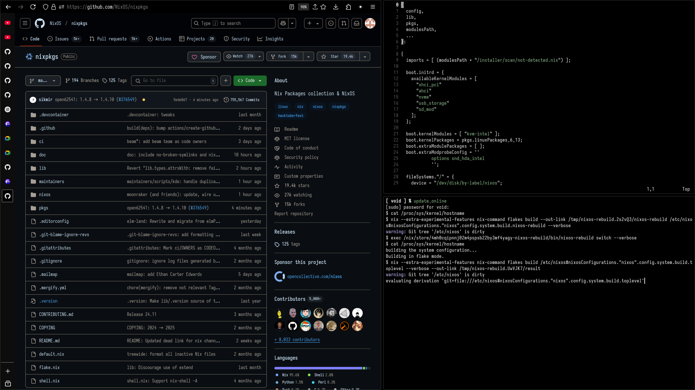

## My Personal NixOS Config

#### Packages Used
- **Compositor** -> [Hyprland](https://github.com/hyprwm/Hyprland)
- **Browser** -> [Firefox](https://github.com/mozilla-firefox/firefox)
- **Terminal** -> [Foot](https://codeberg.org/dnkl/foot)
- **Shell** -> [Zsh](https://www.zsh.org/)
- **Font** -> [Iosevka](https://github.com/be5invis/Iosevka)
- **Code Editor** -> [Neovim](https://github.com/neovim/neovim)
- **File Manager** -> [Nautilus](https://github.com/GNOME/nautilus)
- **Book Reader** -> [Zathura](https://github.com/pwmt/zathura)
- **Image Viewer** -> [Swayimg](https://github.com/artemsen/swayimg)
- **Notification Daemon** -> [Mako](https://github.com/emersion/mako)
- **Screenshot Tool** -> [Grim](https://github.com/emersion/grim)
- **Snapshot Editor** -> [Satty](https://github.com/gabm/Satty)

